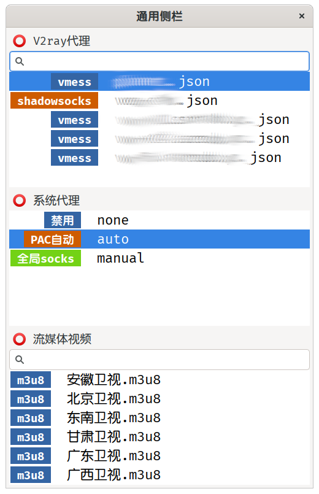

# 通用（屏幕）侧栏

> 从ini格式的配置文件，构建列表，点击执行。单列，瀑布型，类似侧栏。

> 执行时，指定ini格式文件。不指定时，使用同目录的`conf.ini`。

---

{: width="783px"}

## 配置文件格式

> 配置文件格式，直接看`conf.ini`里面的说明。

> GLib.Settings的某些函数又废弃了。暂时取消Switch功能。只保留List功能。

### 字段的说明

- List

	1. 【必要设置】用于列表显示的*命令*。多行字符串。
	1. 每行可使用#分割标签。比如xxx.json#vmess。标签会使用分类的不同颜色显示。
	1. List的输出，完整路径会隐藏，即前面的.*/部分都不会显示。Exec时，会使用完整路径。

- Exec

	1. 【必要设置】用于点击时执行的*命令*。
	1. 选中的List条目的*完整字符串*，会直接附加到命令之后。

- Check

	1. 【可选】用于指定缺省选中高亮的条目，通常用于指示当前的状态。
	1. 单行字符串，用于匹配。

- Search

	1. 【可选】用于显示搜索条。
	1. 缺省为`false`不显示。

### 命令的限制

1. ~~需要shell扩展的，比如`~`和`*`，必须使用`sh -c`和双引号包裹输出。单引号不会扩展。~~
1. ~~带管道的，也必须传给shell执行。程序内的`Process.spawn_command_line_sync`不认管道。~~
1. ~~复杂的命令，或者带各种转义的，不如直接写成脚本。~~
1. 千辛万苦测试，终于通过简单的转义，基本完全兼容了bash的写法。即bash中执行的命令，可以直接复制到各字段设置中。减少了附加脚本。
1. KeyFile读取配置时，或画蛇添足的解析，导致使用*反斜杠*，会出错。所以要避开`\`。

